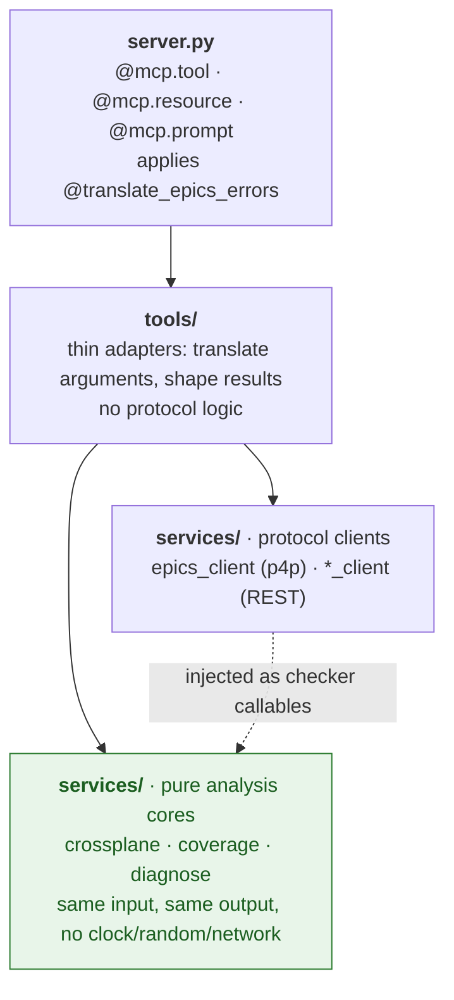
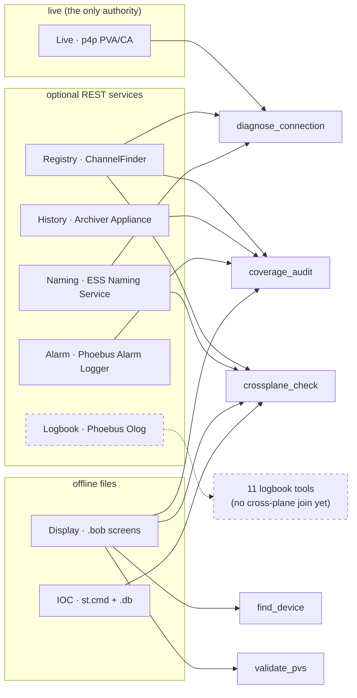

# Architecture

Two things describe this server: how its code is layered, and which *planes* of an EPICS
installation it joins.

## The layering

A one-way dependency flow, `server → tools → services → clients`. Nothing points back up.

The dotted edge is the load-bearing one. The analysis cores never import a client; they receive
protocol access as **injected checker callables**, which is what makes them testable with no
network and deterministic by construction.

- **`server.py`** is the MCP entry point. It declares the tool, resource and prompt surface and
  delegates. Nothing here talks to EPICS directly.
- **`display_tools.py`** holds the four display-aware tools, registered by `server.py` only when
  the optional `opi_navigation` engine (`[displays]`) is importable, so the core server installs
  and runs standalone.
- **`tools/`** are thin MCP adapters. They translate arguments and shape results.
- **`services/`** is the substance: the p4p client (`epics_client.py`), the REST clients
  (`*_client.py`), and the pure analysis cores.
- **Cross-cutting:** `config.py` (env-var settings, fail-fast validation), `safety.py` and
  `olog_safety.py` (the two write gates plus audit), `errors.py` (machine-readable error
  hierarchy), `tool_errors.py` (the error to ToolError decorator), `paths.py` (path boundary).

## The planes

Every cross-plane analysis joins several *planes* of an EPICS installation, and every answer is
framed in those terms.

**The Logbook plane stands alone, on purpose and for now.** Its eleven tools read and write Olog
directly; no analysis correlates a log entry with an archive sample or an alarm transition. It is
drawn dashed so the gap is visible rather than implied: "which logbook entries were written while
this PV was in alarm" is a join this server does not yet make.

## Invariants

- The **Live plane is the only authority** for connected and disconnected. Every other plane is
  *explanatory*: it can inform `likely_cause` or coverage, but never flips the verdict.
- A plane whose service URL is unset is **withheld**, never reported as a false negative
  (`withheld ≠ no`).
- Analysis cores are **pure and deterministic**: same input, same output, no hidden clock, random
  source or network. Protocol access arrives as injected checker callables.
- The server **reads by default and mutates only through a gate.** `set_pv_value` is triple-gated,
  and the four Olog write tools (`create_log_entry`, `reply_to_log`, `add_log_attachment` and
  `update_log_entry`, the last two of which MUTATE an existing entry) sit behind their own,
  separate gate. What either gate can reach is decided by the launcher, not by this server, so
  treat reach as configuration rather than an invariant. See
  [Safety and network posture](docs/safety.md) and [SECURITY.md](SECURITY.md).
