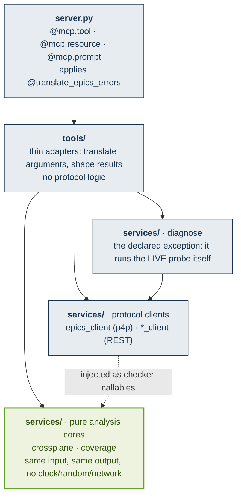
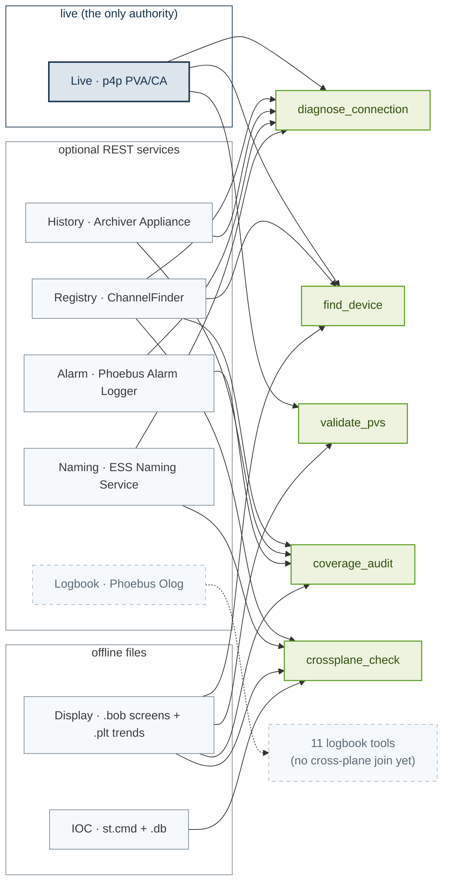

# Architecture

Two things describe this server: how its code is layered, and which *planes* of an EPICS
installation it joins.

## The layering

A one-way dependency flow, `server → tools → services → clients`. Nothing points back up.

The dotted edge is the load-bearing one. The two **pure** cores never import a client; they receive
protocol access as **injected checker callables**, which is what makes them testable with no
network and deterministic by construction. `diagnose` is the declared exception, and it has its own
box for that reason: a connection diagnosis IS a live probe, so it calls `pv_get` directly and
gathers all five planes in one `asyncio.gather`.

⚠️ **The exception is exactly one call wide, and it used to be two.** `diagnose` also built its own
`NamingServiceClient`, while `services/checkers.query_naming_lookup` already ran the same three
steps for the standalone `lookup_device_name` tool, its own comment saying it MIRRORED the
gatherer. That was two copies of one probe, not a second exception, so the gatherer now calls the
query like its three siblings do. What remains is `pv_get`, which is the thing the decision behind
this exception actually justified. The other THREE planes were never client calls: they go through
the same `checkers` query functions as the MCP tools, which is why widening this box to "it probes
the planes itself" reads as more of an exception than the code has ever needed.

- **`server.py`** is the MCP entry point. It declares the tool, resource and prompt surface and
  delegates. Nothing here talks to EPICS directly.
- **`display_tools.py`** holds the four display-aware tools, registered by `server.py` only when
  the `opi_navigation` engine is importable, so the core server installs and runs standalone.
  That engine is a LOCAL dependency group, not a published extra: see `pyproject.toml`.
- **`tools/`** are thin MCP adapters. They translate arguments and shape results.
- **`services/`** is the substance: the p4p client (`epics_client.py`), the REST clients
  (`*_client.py`), the two pure analysis cores, and `diagnose`, which runs the live probe directly.
- **Cross-cutting:** `config.py` (env-var settings, fail-fast validation), `safety.py` and
  `olog_safety.py` (the two write gates plus audit), `errors.py` (machine-readable error
  hierarchy), `tool_errors.py` (the error to ToolError decorator), `paths.py` (path boundary).

## The planes

Every cross-plane analysis joins several *planes* of an EPICS installation, and every answer is
framed in those terms.

Colour carries meaning here, in the EPICS palette (`#18334B` is the single colour of the official
EPICS logo): **navy** is the one authoritative plane, **green** the analyses that consume the
planes, **grey** the explanatory planes, and **dashed grey** a join that does not exist yet.

**The Logbook plane stands alone, on purpose and for now.** Its eleven tools read and write Olog
directly; no analysis correlates a log entry with an archive sample or an alarm transition. It is
drawn dashed so the gap is visible rather than implied: "which logbook entries were written while
this PV was in alarm" is a join this server does not yet make.

## Invariants

- The **Live plane is the only authority** for connected and disconnected. Every other plane is
  *explanatory*: it can inform `likely_cause` or coverage, but never flips the verdict.
- A plane whose service URL is unset is **withheld**, never reported as a false negative
  (`withheld ≠ no`).
- The **pure** analysis cores (`crossplane`, `coverage`) are deterministic: same input, same output,
  no hidden clock, random source or network. Protocol access arrives as injected checker callables.
  `diagnose` is the one declared exception, and it is one CALL wide: it runs the live `pv_get`
  itself, because that probe is the answer it exists to give. Its four explanatory planes go
  through the shared `checkers` queries like every other caller.
- The server **reads by default and mutates only through a gate.** `set_pv_value` is triple-gated
  (a further refusal, the drive-limit bounds check, runs AFTER the gate admits the write and is
  therefore not a fourth gate), and the four Olog write tools (`create_log_entry`, `reply_to_log`,
  `add_log_attachment` and `update_log_entry`, the last two of which MUTATE an existing entry) sit
  behind their own, separate gate of six checks. The two differ in who bounds their reach, and the difference is load-bearing:
  enabling PV write forces a loopback-only EPICS search reach and the process refuses to start
  otherwise, so THAT reach is an invariant rather than configuration. The Olog gate has no such
  assert: its target is whatever `OLOG_URL` the launcher sets, widened by an allowlist and an
  allow-remote switch that are themselves launcher-set, so treat it as configuration. Read reach
  is the launcher's throughout. See
  [Safety and network posture](docs/safety.md) and [SECURITY.md](SECURITY.md).
