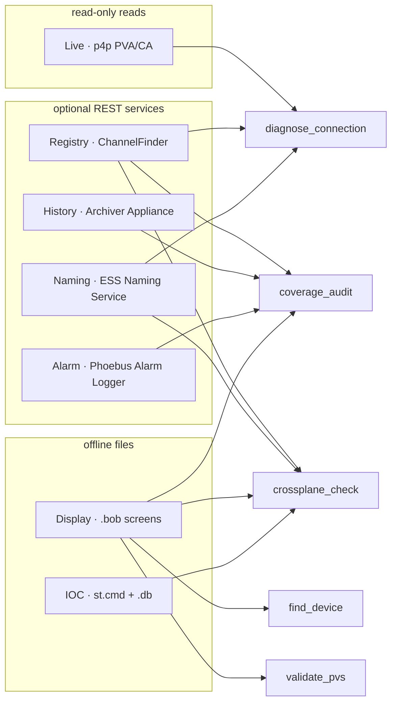

# Architecture

A small, layered server with pure, deterministic analysis cores and injected protocol
clients. The guiding contract is a one-way dependency flow:

```
server → tools → services → clients
```

- **`server.py`** — the MCP entry point. Declares the `@mcp.tool` / `@mcp.resource` /
  `@mcp.prompt` surface, applies `@translate_epics_errors`, and delegates to the tool
  implementations. Nothing here talks to EPICS directly.
- **`display_tools.py`** — the four display-aware tools, registered by `server.py` only
  when the optional `opi_navigation` (`[displays]`) engine is importable, so the core
  server installs and runs standalone.
- **`tools/`** — thin MCP adapters (`_get_pv_value`, `_diagnose_connection`, …). They
  translate arguments and shape results; they hold no protocol logic.
- **`services/`** — the substance: the p4p client (`epics_client.py`), the REST clients
  (`*_client.py`), and the **pure, deterministic analysis cores** (`crossplane.py`,
  `coverage.py`, `diagnose.py`) that take injected protocol *checkers* so they can be
  tested with no network.
- **cross-cutting:** `config.py` (env-var settings, fail-fast validation), `safety.py`
  (write gate + audit), `errors.py` (machine-readable error hierarchy),
  `tool_errors.py` (the error→ToolError decorator), `paths.py` (path boundary).

## The planes

Every analysis joins several *planes* of an EPICS installation:



**Invariants**

- The **Live plane is the only authority** for connected/disconnected. Every other plane
  is *explanatory* — it can inform `likely_cause`/coverage but never flips the verdict.
- A plane whose service URL is unset is **withheld**, never reported as a false negative
  (`withheld ≠ no`).
- Analysis cores are **pure and deterministic**: same input → same output, no hidden
  clock/random/network; protocol access is injected as checker callables.
- The server is **read-only + localhost-isolated by default**; the one mutating tool is
  triple-gated (see the README's *Safety & network posture*).
